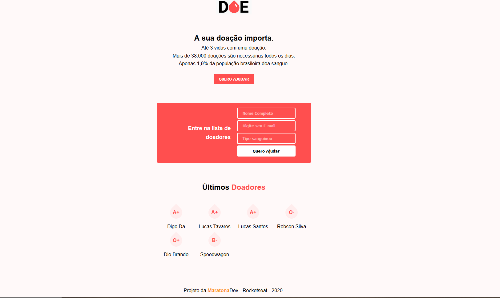

</img>

<h1>Doe Sangue! Doe Vida</h1>

<p>Projeto <strong>MaratonaDev</strong> </p>

<p align="center">
</img>
</p>

# Instalação

Baixe os arquivos do projeto.
Digite no seu terminal `npm install`. A instalação de todas as dependências serão feitas,
após isso, `npm start`.
O projeto está rodando na porta **http://127.0.0.1:3000/**.

No arquivo **server.js** temos toda a configuração necessária para rodar o projeto.
Baixe o banco de dados no link abaixo, e vamos lá pras configurações!

```
const db = new Pool({
    user: 'SEU USUÁRIO',
    password: 'SUA SENHA',
    host: 'localhost',
    port: 5432,
    database: 'DATABASE CRIADA POR VOCÊ'
})
```

Configurações acima são para ter acesso ao seu banco de dados.
o localhost e o port são o padrão que vem na instalação do Postbird.

---

```
server.get('/', (req, res) =>{
    db.query(`SELECT * FROM TABELA`, (err, result) =>{
        if(err) return res.send('Erro no banco de dados.')

        const donors = result.rows;
        return res.render('index.html', { donors });
    })

})
```

Apenas troque os nomes pelos correspondentes que você criou na sua máquina.

```
server.post('/', (req, res) =>{
    const name = req.body.name; (São os inputs do formulário)
    const email = req.body.email; (São os inputs do formulário)
    const blood = req.body.blood; (São os inputs do formulário)

    if(name == '' || email == '' || blood == ''){
        return res.send('Preencha todos os campos.');
    };

    const query = `INSERT INTO TABELA("campo da tabela", "campo da tabela", "campo da tabela") VALUES ($1, $2, $3)`;

    ...

    });
})
```

Aqui você basicamente vai trocar o nome das variáveis e dos bancos da tabela de acordo com o seu banco de dados.

# Sobre o projeto

É o projeto da MaratonaDev da Rocketseat.
O instrutor é o <a href="https://github.com/maykbrito">Mayk Brito</a>. (Super carismático!)

No backend usamos <a href="https://nodejs.org/en/">NodeJS</a> e o banco de dados é <a href="https://www.electronjs.org/apps/postbird">Postbird</a>.

Também usamos <a href="https://expressjs.com/">Express</a> e <a href="https://mozilla.github.io/nunjucks/">Nunjucks</a>

# Modificações

Apenas algumas poucas coisas na estilização, fora isso, o projeto está idêntico ao feito nos dias da maratona.
